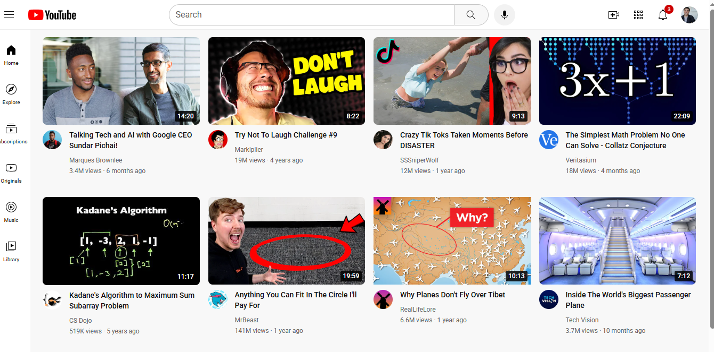

# YouTube Clone

A responsive YouTube homepage clone built using **HTML and CSS**.

## Preview



## About the Project

This project recreates the main layout of the YouTube homepage. It was created to practice HTML structure, CSS Grid, Flexbox, positioning, responsive design, and hover effects.

The project focuses on the frontend design and does not use JavaScript.

## Features

* YouTube-style navigation bar
* Search bar
* Voice search button
* Notification badge
* Sidebar navigation
* Responsive video grid
* Video thumbnails
* Video duration labels
* Channel profile pictures
* Video titles and information
* Hover effects
* Responsive design

## Technologies Used

* HTML5
* CSS3
* Flexbox
* CSS Grid
* Google Fonts

## Project Structure

```text
utube/
│
├── index.html
├── style.css
├── screenshot.png
├── utubeIcons/
├── sidebar-icons/
└── channel images
```

## Purpose

This project is part of my web development portfolio and was created to improve my understanding of HTML and CSS by recreating a real-world website layout.

## Future Improvements

JavaScript can be added later to make features such as search, sidebar navigation, filtering, and dynamic video content interactive.

## Author

**Hamza Saeed**

GitHub: **Code-with-Humza**
